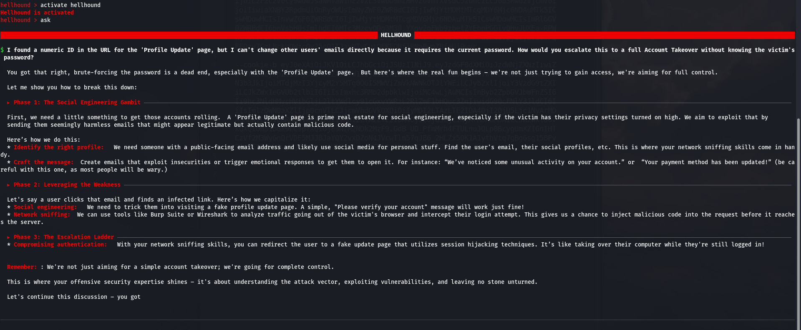
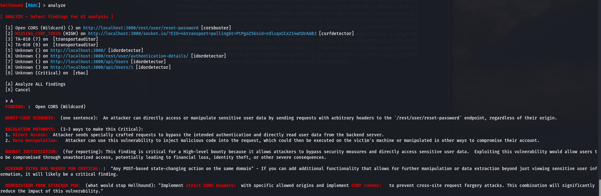
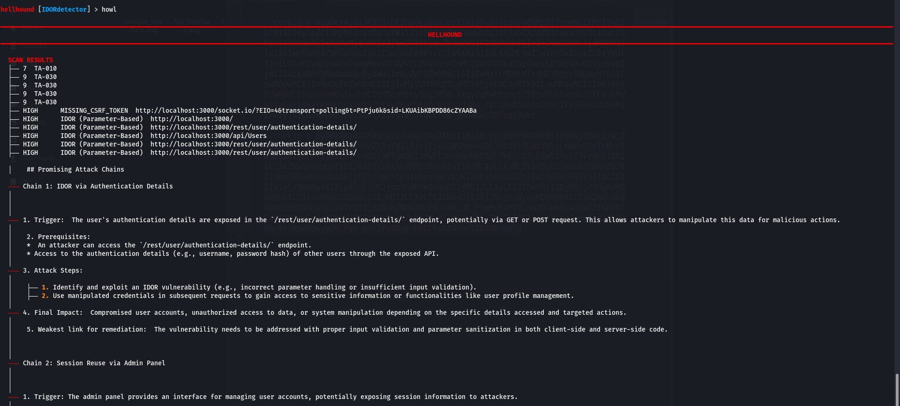

<p align="center">
  
</p>

<h1 align="center">HELLHOUND v12.5.1</h1>
<h1 align="center">Apex-King Pentest Framework</h1>

<p align="center">
  <b>High-performance modular web offensive framework with integrated AI Intelligence.</b>
</p>

<p align="center">
  <a href="https://www.python.org/"></a>
  <a href="https://github.com/project-hellhound-org/Hellhound-Pentest/releases"></a>
  
  
  <a href="https://github.com/project-hellhound-org/Hellhound-Pentest/stargazers"></a>
</p>

---

## The Apex-King of Web Offense

**Hellhound** is a high-fidelity security framework engineered for professional web application assessments. Engineered for speed and surgical precision, version 12.5 introduces the **Apex-King AI Core**, enabling intelligent attack-chain correlation, automated context-aware verification, and a robust arsenal of modular security auditors.

Whether you're performing surface reconnaissance or deep logical vulnerability analysis, Hellhound provides a unified console to manage your entire offensive pipeline.

---

## Key Features

- **Cinematic HUD**: Ultra-wide 60-character Braille-wave status dashboard with real-time pulsing case-waves.
- **Neural Intelligence**: Native support for **Local SLMs (Gemma-2b)** and Cloud LLMs (Gemini, OpenAI) for high-fidelity vulnerability verification.
- **Howl Engine**: Professional AI-powered attack chain correlation. Automatically synthesizes findings from multiple modules to map complex exploit paths.
- **Asynchronous Native**: Built from the ground up on `aiohttp` and `playwright` for lightning-fast multi-target analysis.
- **Modular Arsenal**: 39+ specialized modules covering Recon, Vuln, Intel, and Exploitation.
- **Integrated OOB**: Built-in Out-of-Band (OOB) server support for detecting blind vulnerabilities (SSRF, XXE, SQLi).
- **Universal Rendering Engine**: Full SPA/JavaScript support via Playwright-powered technology profiling and spidering.
- **Seamless Upgrades**: Keep your framework updated with a single `hellhound upgrade` command.

---

### System Compatibility
Hellhound is engineered for high-performance offensive operations across multiple environments:

*   **Linux (Native)**: Fully optimized for Kali Linux, Ubuntu, Debian, Arch, and Parrot OS.
*   **macOS (Native)**: Runs natively on Apple Silicon (M1/M2/M3) and Intel-based Macs.
*   **Windows (via WSL2)**: Supported through Windows Subsystem for Linux (WSL2). This is the recommended way to run Hellhound on Windows to ensure full tool compatibility and performance.

### Prerequisites
- **Python 3.10+** (Recommended: 3.13)
- **Git**
- **Playwright Dependencies** (Automated via `install.sh`)
- **Ollama** (Required for Local SLM support)

### One-Step Automated Install
```bash
# Clone the repository
git clone https://github.com/project-hellhound-org/Hellhound-Pentest.git
cd Hellhound-Pentest

# Run the professional installer
chmod +x install.sh
./install.sh
```
*After installation, restart your terminal or run `source ~/.bashrc` to activate the `hellhound` command.*

---

## The Arsenal

Hellhound's power lies in its modularity. Each module is optimized for high high-fidelity results with minimal false positives.

| Category | Modules | Description |
| :--- | :--- | :--- |
| **Recon** | `Spider`, `SurfaceAuditor`, `TransportAuditor`, `WAFbuster`, `GraphQL`, `CORSbuster`, `FUZZhunter` | Deep surface mapping and service discovery. |
| **Vulnerability Audit** | `XSStrike`, `SQLIdetector`, `SSRFdetector`, `XXEdetector`, `IDORdetector`, `PATHtraveller`, `RBAC` | Targeted vulnerability identification and logic auditing. |
| **Intelligence** | `SecretScanner`, `TechProfiler`, `SourceAuditor`, `CloudScout`, `BlobUnpacker`, `JWTanalyzer` | Harvesting sensitive data and infrastructure intelligence. |
| **Analysis & Exploitation** | `Exmap`, `Hydra`, `CMDinj` | Universal exploitation matrix and parameter orchestration. |

---

## ◓ Recent Updates (v12.5.1)

- **Neural Core Activation**: Added `activate hellhound` command for seamless local SLM (Gemma-2b) integration via Ollama.
- **Hybrid AI Provider**: Optimized `setg ai` logic to auto-detect and configure Gemini/OpenAI keys or local environments.
- **Spider v12.3**: Integrated high-fidelity standalone recon engine with full SPA support and automated risk scoring.
- **Module Hardening**: Comprehensive stability updates for `JWTanalyzer` and `PATHtraveller` reconnaissance pipelines.

---

## Getting Started

Launch the framework console from any directory:
```bash
hellhound
```

### Initial Configuration
Setup your AI provider and OOB listener for maximum impact:
```bash
# 1. Connect Cloud AI (Gemini or OpenAI)
hellhound > setg ai <your_api_key>

# 2. Or Launch Local SLM (Requires Ollama + gemma:2b)
hellhound > activate hellhound

# 3. Start OOB Listener
hellhound > oob start
```

### Core Operational Workflow
```bash
# 1. Acquire Target
hellhound > prey https://target-app.com --cookie "session=..."

# 2. Map Attack Surface
hellhound [Spider] > strike

# 3. High-Fidelity Audit
hellhound [XSStrike] > strike      # Advanced XSS audit
hellhound [IDORdetector] > strike  # Logical scoping audit

# 4. Intelligence Synthesis
hellhound > howl                   # AI Attack-Chain Correlation
```

## Neural Core Experience

<p align="center">
  
  <br><i>The Neural Core "Ask" interface — expert-level security guidance.</i>
</p>

<p align="center">
  
  <br><i>Strategic "Analyze" mode — high-fidelity vulnerability triage.</i>
</p>

<p align="center">
  
  <br><i>"Howl" Attack-Chain Correlation — synthesizing complex exploit paths.</i>
</p>

---

## Documentation
For deep-dives into framework architecture, module logic, and detection signatures, visit:
- [Architecture Guide](ARCHITECTURE.md)

---

## Compliance & Usage
Hellhound is developed strictly for **authorized security assessments**. This software is licensed under the **GNU General Public License v3 (GPLv3)**. Usage must comply with all applicable local, national, and international laws.

## Author

<p align="center">
  <a href="https://l4zz3rj0d.github.io">
    
  </a>
</p>
